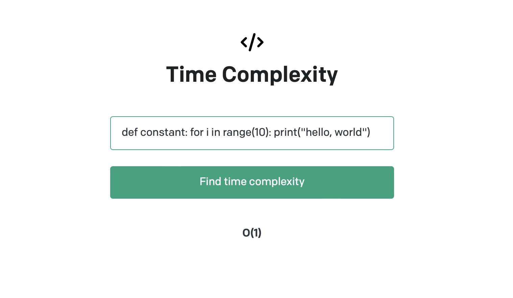

# OpenAI API - Time Complexity

This is a simple application that uses the `text-davinci-003` model to find the time compexity of a given piece of code. It uses the [Next.js](https://nextjs.org/) framework with [React](https://reactjs.org/). Check out the tutorial or follow the instructions below to get set up.



## Setup

1. If you don’t have Node.js installed, [install it from here](https://nodejs.org/en/)

2. Clone this repository

3. Navigate into the project directory

   ```bash
   $ cd openai-time-complexity
   ```

4. Install the requirements

   ```bash
   $ npm install
   ```

5. Make a copy of the example environment variables file

   On Linux systems:

   ```bash
   $ cp .env.example .env
   ```

   On Windows:

   ```powershell
   $ copy .env.example .env
   ```

6. Add your [API key](https://beta.openai.com/account/api-keys) to the newly created `.env` file

7. Run the app

   ```bash
   $ npm run dev
   ```

You should now be able to access the app at [http://localhost:3000](http://localhost:3000)! For the full context behind this example app, check out the [tutorial](https://beta.openai.com/docs/quickstart).
